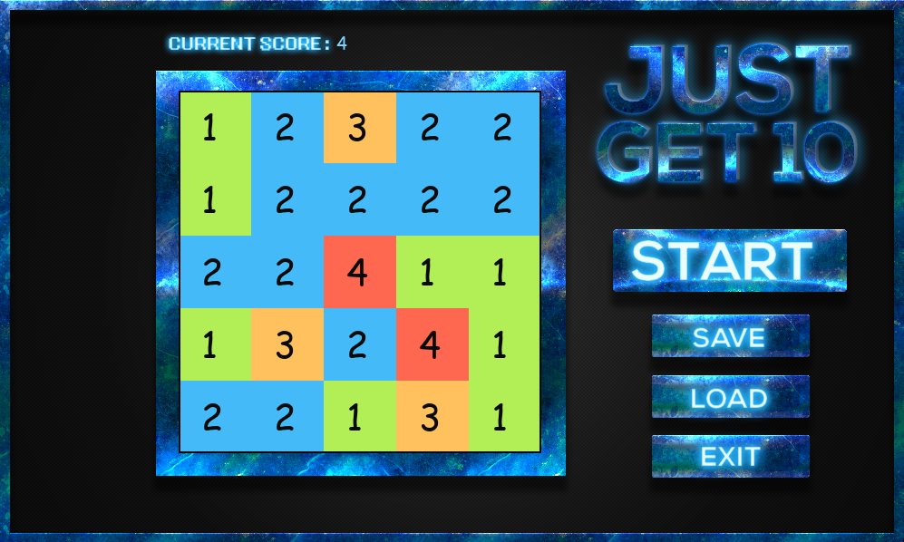

# Get 10

Welcome to **Get 10**, an addictive puzzle game developed in Python using the Pygame library! 
This game challenges your strategic thinking and planning skills in a delightful and engaging way.

## About the Game

**Get 10** is a popular puzzle game that is easy to learn but hard to master. The goal is simple: combine numbers on a grid to create the number 10. With each move, identical numbers merge and increase in value, offering endless opportunities for creating new strategies and high scores. 

### Features

- **Intuitive Gameplay:** Simple controls and straightforward mechanics make it easy to pick up and play.
- **Challenging Puzzles:** Increasing difficulty levels ensure that the game remains challenging and engaging.
- **Clean and Elegant Design:** Enjoy a visually pleasing interface that enhances your gaming experience.
- **High Scores:** Compete with yourself and others to achieve the highest score possible.
- **Sound Effects and Music:** Immerse yourself in the game with enjoyable sound effects and background music.

## Screenshots



## Installation

Follow these steps to set up and play **Get 10** on your local machine:

1. **Clone the repository:**
   ```bash
   git clone https://github.com/yourusername/get-10.git
   ```
2. **Navigate to the project directory:**
   ```bash
   cd get-10
   ```
3. **Install the required dependencies:**
   ```bash
   pip install -r requirements.txt
   ```
4. **Run the game:**
   ```bash
   python justGetTenGUI.py
   ```

## How to Play

1. Click on adjacent tiles with the same number to merge them.
2. The merged tiles will increment by one.
3. Plan your moves carefully to avoid filling up the grid.
4. Aim to create a tile with the number 10.

## Contributing

We welcome contributions from the community! Feel free to fork the repository and submit pull requests. Whether it’s bug fixes, feature enhancements, or new ideas, your input is valuable.

## License

This project is licensed under the MIT License. See the [LICENSE](LICENSE) file for more details.

## Connect with Us

For any questions, suggestions, or feedback, please open an issue on GitHub or contact us at [rhodu13@gmail.com].
